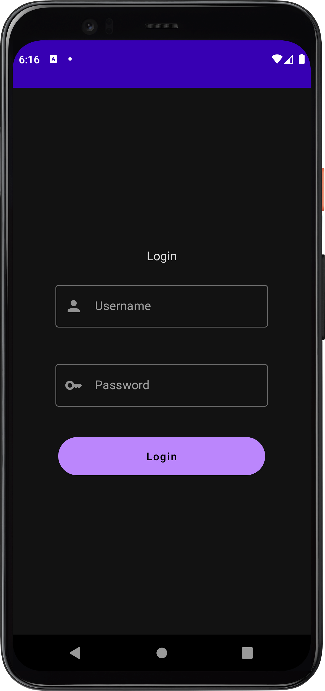
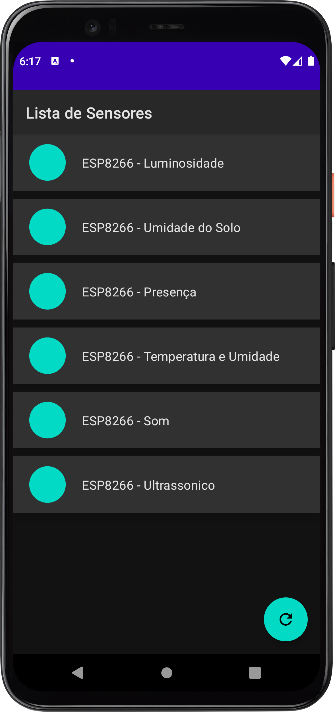
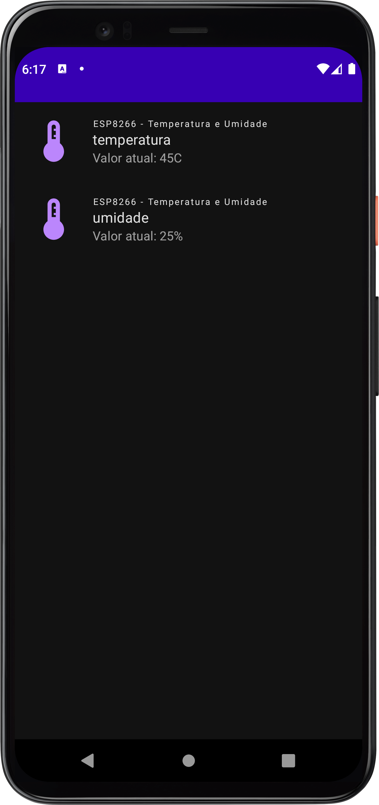

# Smart Factory App
Este é o projeto do aplicativo de Android criado para a disciplina MC855 -  Projeto em Sistemas de Computação durante o segundo semestre de 2022.

## Objetivo
O objetivo do aplicativo é apresentar para funcionário de uma fábrica os status de sensores conectados à máquinas.

## Integrações

O aplicativo realiza _requests_ para o _backend_ do projeto que fornece os dados dos sensores.
Além disso, autentica os usuários por meio do _Keycloak_, uma ferramenta de gerenciamento de usuários.

## Telas do Aplicativo

